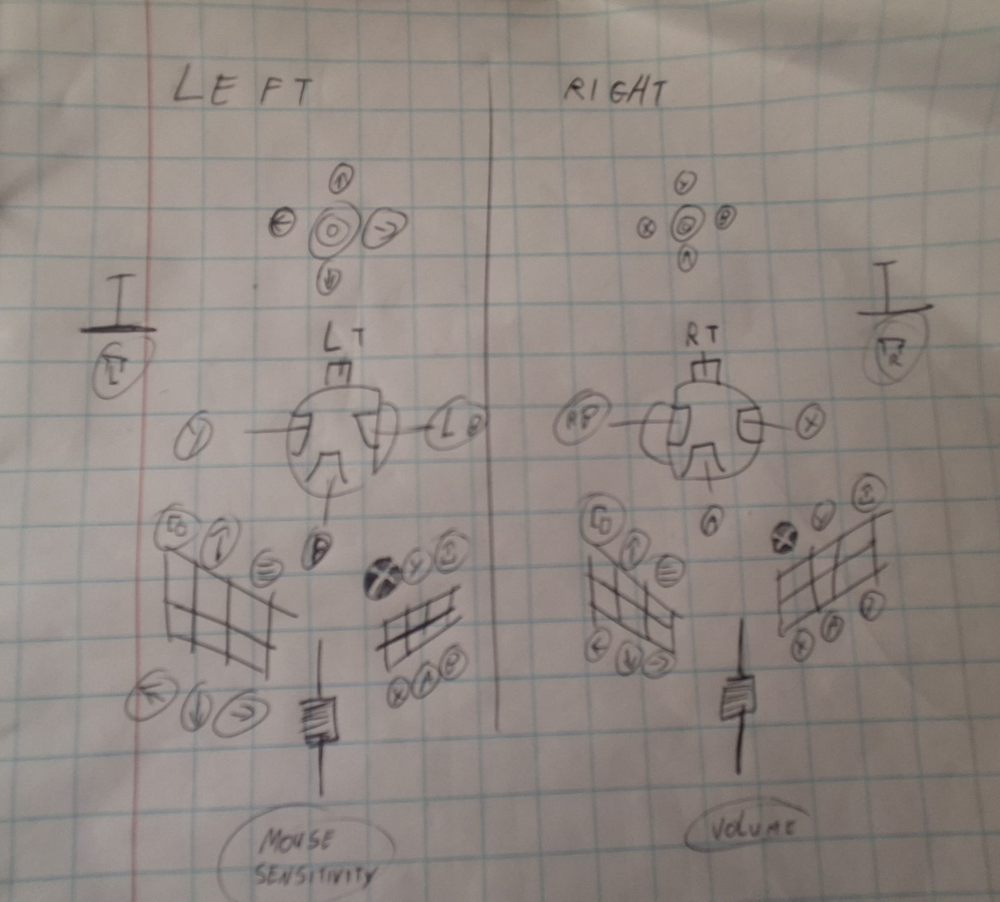

# duo_t16000m_to_virtual_controller_translator

- [x] read out joystick values
- [x] virtual controller
- [x] left joystick xy to wasd
- [x] right joystick xy to mouse xy
- [x] triggers to LT and RT
- [x] map joystick buttons
- [x] map joystick hat to arrows and XABY
- [x] Windows GUI app with debug view, recalibration, and custom mapping profiles
- [ ] map throttle button (slider left = mouse sensitivity, slider right = volume)
- [ ] map extra button on base
- [ ] map horizontal X rotation for X joystick acceleration

## Setup guide

1. Install the [ViGEmBus driver](https://github.com/ViGEm/ViGEmBus/releases) — this lets `vgamepad` create a virtual Xbox 360 controller on Windows.
2. Plug in both T.16000M joysticks.
3. Either grab `HOSAS Translator.exe` from a build (see [Building the .exe](#building-the-exe)) and run it, or run from source:
   ```
   pip install -r requirements.txt
   python gui.py
   ```

### Using the app

- **Control** — shows connection status, lets you pick the active mapping, and has the Start/Stop button that turns the virtual Xbox 360 controller on and off.
- **Debug** — live raw axis/button/hat values plus the processed stick x/y and trigger state for both sticks, useful for confirming your hardware's indices.
- **Calibration** — both T.16000M units report identical hardware IDs with no serial, so left/right is determined once by wiggling the left stick; the result is cached so this normally only runs the first time. If you swap which stick is in which USB port, use **Recalibrate** here.
- **Configs** — browse the built-in **Default** mapping (read-only) and any custom mappings you've made. **New from Default** clones it into an editable copy; the editor lets you point-and-click a target Xbox button for every stick button and hat direction, plus axis indices, deadzone, poll rate, and Y-inversion — no JSON editing needed. **Set as Active** switches which mapping the Control tab's virtual controller uses.

All of this is stored per-user under `%APPDATA%\HOSAS_Translator\` (the Default mapping, your custom mappings, the USB-port calibration cache, and which mapping was last active), so it's independent of where the app is installed or run from.

### Command line

The same engine is also usable headless, e.g. for scripting or quick hardware checks:

```
python main.py --test          # print processed stick/trigger values
python main.py --debug         # print raw axis/button/hat changes as they happen
python main.py --recalibrate   # redo the left/right wiggle test
python main.py --config NAME   # use a custom mapping instead of Default
python main.py                 # run the translator (Ctrl+C to stop)
```

## Building the .exe

```
pip install -r requirements-dev.txt
.\build.ps1
```

This produces a single-file `dist\HOSAS Translator.exe` with `--noconsole` (no terminal window) that bundles the Python interpreter, so the target machine only needs the ViGEmBus driver installed, not Python. Since it's an unsigned homebrew build, Windows SmartScreen may ask you to confirm "Run anyway" the first time.

## Button mapping

The Default mapping (`DEFAULT_CONFIG` in [config_store.py](config_store.py)) maps buttons as follows; `BUTTON_NAME_MAP` in the same file lists every supported target name, and the Configs tab in the app lets you build your own layout without editing code.


| T.16000M input | Left stick → | Right stick → |
| --- | --- | --- |
| Trigger (button 0) | LT | RT |
| Button 1 | B | A |
| Button 2 | Y | RB |
| Button 3 | LB | X |
| Hat up | D-Pad up | Y |
| Hat down | D-Pad down | A |
| Hat left | D-Pad left | X |
| Hat right | D-Pad right | B |
| Hat diagonal (↖) | Left stick click (L3) | Right stick click (R3) |
| Button 5 | Y | Y |
| Button 6 | Guide (Xbox button) | Guide (Xbox button) |
| Button 7 | X | X |
| Button 8 | A | A |
| Button 9 | B | B |
| Button 10 | Back | Back |
| Button 11 | D-Pad up | D-Pad up |
| Button 12 | Start | Start |
| Button 13 | D-Pad right | D-Pad right |
| Button 14 | D-Pad down | D-Pad down |
| Button 15 | D-Pad left | D-Pad left |
| Button 4, 16–19 | unmapped | unmapped |

Button 4 (screenshot/share) has no Xbox 360 equivalent — `VX360Gamepad` emulates a 360 pad, which predates that button.


